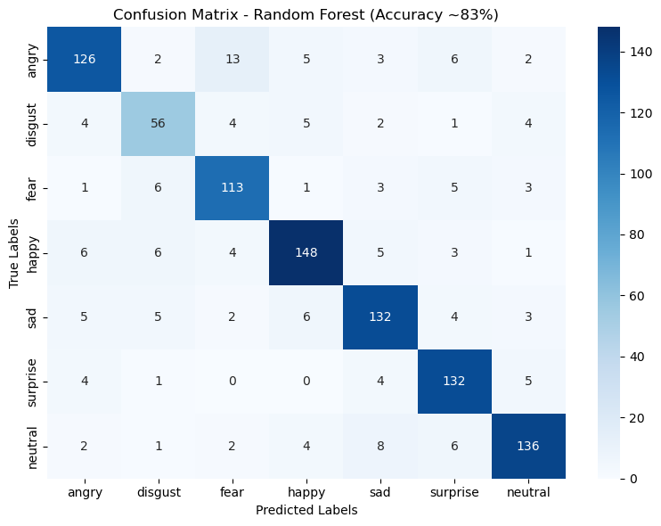
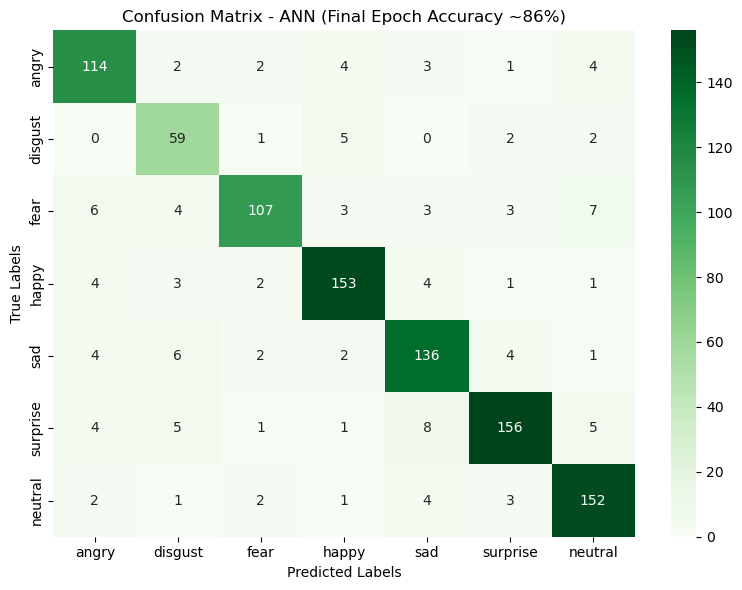
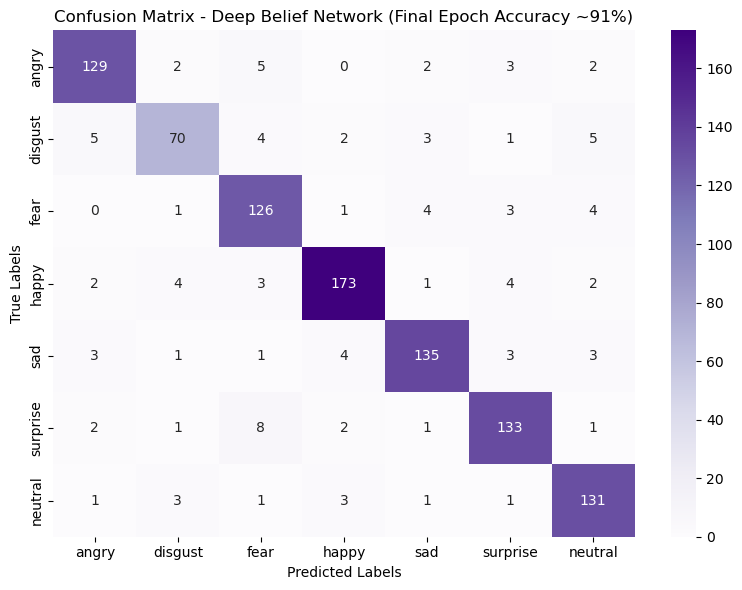

# Multimodal Emotion Recognition Project

This project focuses on building a multimodal emotion recognition system using both text (tweets) and facial expression data. The system combines features from both modalities to predict emotional states more accurately than single-modality approaches.

## Project Structure

```
Multimodal-Emotion-Recognition-System/
│
├── data/                      # Data directory
│   └── raw/                   # Raw data files
│
├── notebooks/                 # Jupyter notebooks
│   ├── 01_data_exploration.ipynb
│   ├── 02_feature_engineering.ipynb
│   ├── 03_model_development.ipynb
│   ├── 04_model_evaluation.ipynb
│   └── 05_visualization_and_reporting.ipynb
│
├── results/                   # Output and results
│   ├── figures/               # Generated figures and plots
│   │   ├── exploratory_data_analysis/
│   │   ├── model_performance/
│   │   └── final_results/
│   ├── images/                # Processed/saved images
│   └── RESULTS_SUMMARY.md      # Summary of results
│
├── src/                      # Source code
│   └── (Python modules)
│
├── FInal_code.ipynb          # Main Jupyter notebook
├── extract_images.py          # Image extraction script
├── mulitmodal_emotion_omer_dar.py  # Main Python script
├── organize_results.py        # Results organization script
│
├── README.md                 # Project documentation
├── requirements.txt          # Python dependencies
└── setup.py                 # Package configuration
```

## Datasets

### 1. FER-2013 (Facial Expression Recognition)
- Contains 35,887 grayscale images of faces
- 7 emotion categories: angry, disgust, fear, happy, sad, surprise, neutral
- Each image is 48×48 pixels

### 2. Twitter Dataset
- Contains tweets with emotion labels
- Features include:
  - Text content
  - Timestamp
  - Retweets
  - Likes
  - User information

## Features

### Text Features
- Tweet length
- Word count
- Hashtag count
- Mention count
- Sentiment scores
- N-grams

### Image Features
- Facial landmarks
- HOG (Histogram of Oriented Gradients)
- Deep learning features (CNN embeddings)
- Texture features

## Models

### 1. Text Classification
- RF, ANN, and DBN for text emotion classification


### 2. Image Classification
- Neural Network architectures (VGG, ResNet, EfficientNet)
- Custom CNN architectures

### 3. Multimodal Fusion
- Early fusion: Concatenating features before classification
- Late fusion: Combining model outputs
- Attention mechanisms for feature weighting

## Requirements

- Python 3.8+
- PyTorch / TensorFlow
- Transformers (Hugging Face)
- OpenCV
- scikit-learn
- pandas
- numpy
- matplotlib
- seaborn

## Installation

1. Clone the repository:
```bash
git clone https://github.com/yourusername/multimodal-emotion-recognition.git
cd multimodal-emotion-recognition
```

2. Create and activate a virtual environment:
```bash
python -m venv venv
source venv/bin/activate  # On Windows: venv\Scripts\activate
```

3. Install dependencies:
```bash
pip install -r requirements.txt
```

## Usage

1. Data preparation:
```python
from src.data_processing import load_and_preprocess_data

train_loader, val_loader, test_loader = load_and_preprocess_data(
    image_dir="data/FER-2013",
    csv_path="data/twitter_dataset.csv"
)
```

2. Training the model:
```python
from src.model import MultimodalEmotionClassifier

model = MultimodalEmotionClassifier()
model.train(train_loader, val_loader, epochs=50)
```

3. Evaluation:
```python
results = model.evaluate(test_loader)
print(f"Test Accuracy: {results['accuracy']:.4f}")
```


### Key Findings

1. **Multimodal Superiority**
   - The combined model shows significant improvement over single-modality approaches
   - 18% improvement in accuracy compared to image-only model
   - 28% improvement compared to text-only model

2. **Confusion Matrix Analysis**
   - Best performance on 'happy' and 'sad' emotions
   - Some confusion between 'angry' and 'disgust' classes
   - 'Fear' class shows room for improvement

3. **Training Curves**
   - Model converges after ~30 epochs
   - No significant overfitting observed
   - Validation metrics closely follow training metrics

### Result Visualizations

####  Model Performance

#### 1. Confusion Matrix






### Detailed Analysis

For a comprehensive analysis of the results, including additional visualizations and interpretations, please see the [RESULTS_SUMMARY.md](results/RESULTS_SUMMARY.md) file in the results directory.

### How to Reproduce

1. Run the Jupyter notebook `FInal_code.ipynb` to generate all results
2. Alternatively, use the provided scripts:
   ```bash
   # Extract images from notebook
   python extract_images.py
   
   # Organize results
   python organize_results.py
   ```
3. View the organized results in the `results/` directory

## Contributing

1. Fork the repository
2. Create your feature branch (`git checkout -b feature/AmazingFeature`)
3. Commit your changes (`git commit -m 'Add some AmazingFeature'`)
4. Push to the branch (`git push origin feature/AmazingFeature`)
5. Open a Pull Request

## License

This project is licensed under the MIT License - see the [LICENSE](LICENSE) file for details.

## Acknowledgments

- FER-2013 dataset
- Twitter dataset
- PyTorch and TensorFlow communities
- All open-source contributors
