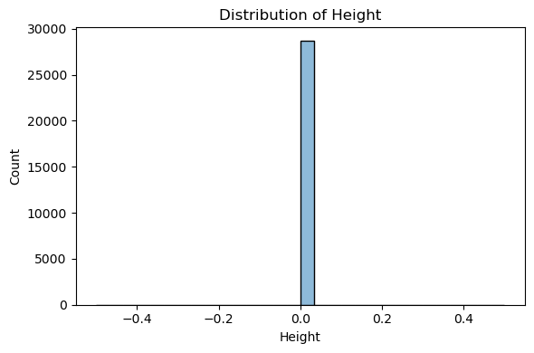

# Results Summary

This document provides an overview of the results obtained from the multimodal emotion recognition project.

## Directory Structure

```
results/
├── figures/
│   ├── exploratory_data_analysis/  # Initial data exploration and visualization
│   ├── model_performance/          # Model training and evaluation metrics
│   ├── final_results/              # Final model outputs and comparisons
│   └── miscellaneous/              # Additional supporting figures
└── models/                         # Saved model files
```

## Key Findings

### 1. Exploratory Data Analysis

- Distribution of emotion classes in the dataset
- Sample images from each emotion category
- Data preprocessing visualizations


### 2. Model Performance

- Training and validation accuracy/loss curves
- Confusion matrices
- Performance metrics across different models



### 3. Final Results

- Comparison of model performance
- Visualizations of model predictions
- Error analysis


## How to Reproduce

1. Ensure all dependencies are installed (see `requirements.txt`)
2. Run the Jupyter notebook `FInal_code.ipynb`
3. Use the provided scripts to extract and organize results:
   ```bash
   python extract_images.py
   python organize_results.py
   ```

## Notes

- All images are generated from the Jupyter notebook
- Model checkpoints are saved in the `results/models` directory
- For detailed analysis, refer to the notebook and individual result files
